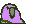

<!--
**bentondecusin/bentondecusin** is a ✨ _special_ ✨ repository because its `README.md` (this file) appears on your GitHub profile.

Here are some ideas to get you started:

- 🔭 I’m currently working on ...
- 🌱 I’m currently learning ...
- 👯 I’m looking to collaborate on ...
- 🤔 I’m looking for help with ...
- 💬 Ask me about ...
- 📫 How to reach me: ...
- 😄 Pronouns: ...
- ⚡ Fun fact: ...
-->

  

      
      
      
      
      
      
      
      
      
      
      
      
            
      
      
      
      
      
      
      
      
  

  

      <a>Wassup!</a>  
  

    

    
    
    
    
    
    
    
    
    
    
    
    
          
    
    
    
    
    
    
    
    
  

  

